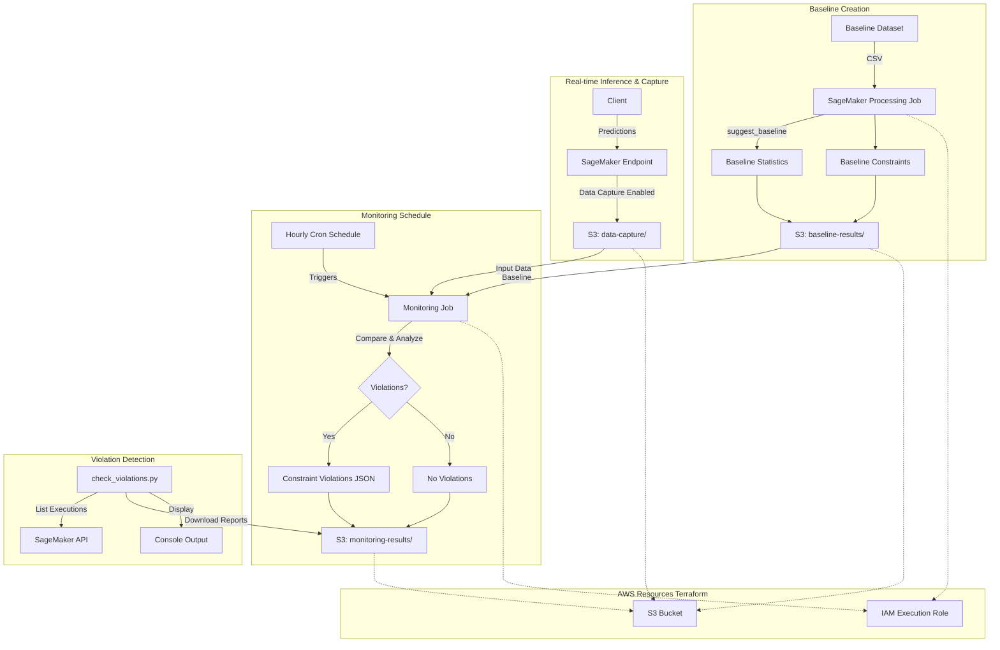

# SageMaker Model Monitor Starter

[](https://github.com/saranreddy/sagemaker-model-monitor-starter/actions/workflows/ci.yml)
[](https://opensource.org/licenses/MIT)
[](https://www.python.org/downloads/)

A production-ready AWS SageMaker Model Monitor starter for continuous ML model quality monitoring. This repository provides a complete, working example of SageMaker Model Monitor: baseline creation → monitoring schedule → violation detection.

Companion to [sagemaker-mlops-pipeline-starter](https://github.com/saranreddy/sagemaker-mlops-pipeline-starter) for end-to-end MLOps workflows.

Built with best practices for clarity, maintainability, and professional ML operations.

## Features

- **Data Quality Monitoring** with automatic baseline generation and scheduled monitoring jobs
- **Infrastructure as Code** with Terraform for repeatable AWS resource provisioning (IAM roles, S3)
- **Flexible deployment** - works standalone or as companion to the MLOps pipeline starter
- **Constraint violation detection** with clear reporting and S3-backed audit trails
- **Professional structure** with clear separation of concerns and CLI entrypoints
- **CI/CD ready** with GitHub Actions for linting, testing, and Terraform validation
- **Cost-conscious** with cleanup guidance and configurable monitoring schedules

## Architecture



## Prerequisites

- **AWS Account** with IAM permissions to create roles, S3 buckets, and SageMaker resources
- **AWS CLI** installed and configured with your credentials (`aws configure`)
- **Python 3.10+** installed locally
- **Terraform 1.0+** installed locally
- **Git** for cloning this repository
- **SageMaker Endpoint** (optional - see deployment modes below)

## Deployment Modes

This starter supports two deployment modes:

### Mode A: Companion to MLOps Pipeline Starter (Recommended)

Monitor the endpoint created by [sagemaker-mlops-pipeline-starter](https://github.com/saranreddy/sagemaker-mlops-pipeline-starter):

1. Deploy the MLOps pipeline starter and create the `california-housing-endpoint`
2. Use this repository to enable Model Monitor on that endpoint
3. Monitor data quality for production traffic

### Mode B: Standalone Demo

Generate a small baseline dataset and enable monitoring:

1. Run `python src/scripts/create_baseline_data.py` to generate demo data
2. Create baseline and monitoring schedule
3. Use any existing endpoint or create a simple test endpoint

**Note**: This README demonstrates Mode B (standalone). For Mode A, skip the baseline data generation step and point to your existing endpoint in `config/config.yaml`.

## Run Against Your AWS Account

### Step 0: Verify Your Setup

Your AWS CLI credentials will be used to run Terraform and create a separate SageMaker execution role. Ensure:

```bash
# Check AWS CLI is configured
aws sts get-caller-identity

# Verify your default region (must match terraform and config.yaml)
aws configure get region
```

**CRITICAL**: Note your AWS region. You must use the same region in:
1. AWS CLI default region (`aws configure get region`)
2. Terraform variables (`infra/terraform.tfvars` or CLI default)
3. Model Monitor configuration (`config/config.yaml`)
4. Your SageMaker endpoint (if using companion mode)

Region mismatch is the most common setup failure.

### Step 1: Clone and Set Up Python Environment

```bash
git clone https://github.com/saranreddy/sagemaker-model-monitor-starter.git
cd sagemaker-model-monitor-starter

# Create and activate virtual environment
python -m venv venv
source venv/bin/activate  # On Windows: venv\Scripts\activate

# Install dependencies
pip install -r requirements.txt
```

### Step 2: Provision AWS Infrastructure with Terraform

```bash
cd infra

# Initialize Terraform
terraform init

# (Optional) Customize region or names
cp terraform.tfvars.example terraform.tfvars
# Edit terraform.tfvars if you want non-default values

# Review planned resources
terraform plan

# Create resources (type 'yes' when prompted)
terraform apply
```

Terraform creates:
- S3 bucket (with versioning and encryption) for baselines, captured data, and monitoring reports
- IAM execution role for SageMaker Model Monitor (least-privilege permissions)

**Save the outputs**:

```bash
terraform output
```

Copy the displayed `sagemaker_role_arn` and `s3_bucket_name` for the next step.

### Step 3: Configure Model Monitor

```bash
cd ..
cp config/config.example.yaml config/config.yaml
```

Edit `config/config.yaml` with values from Terraform:

```yaml
aws_region: us-east-1  # MUST match your AWS CLI region
sagemaker_role_arn: arn:aws:iam::YOUR_ACCOUNT_ID:role/sagemaker-model-monitor-execution-role
s3_bucket: sagemaker-model-monitor-YOUR_ACCOUNT_ID
endpoint_name: california-housing-endpoint  # Or your endpoint name
```

**Important**: 
- Do NOT leave placeholder values like `123456789012`. The scripts validate and will reject them.
- For companion mode, use the endpoint name from the MLOps starter
- For standalone mode, you'll need to create or specify an existing endpoint

### Step 4: Generate Baseline Dataset (Standalone Mode Only)

If you're using your own endpoint (companion mode), skip this step.

```bash
# Generate a small baseline dataset from California Housing data
python src/scripts/create_baseline_data.py
```

This creates `data/baseline/baseline.csv` with 1,000 samples (headerless CSV as required by Model Monitor).

### Step 5: Create Baseline Statistics and Constraints

```bash
# Run baseline job (takes 5-10 minutes)
python scripts/create_baseline.py
```

This script:
1. Uploads baseline data to S3
2. Runs a SageMaker Processing job (`DefaultModelMonitor.suggest_baseline`)
3. Generates `statistics.json` and `constraints.json`
4. Saves results to `s3://{bucket}/baseline-results/`

Monitor progress:
- AWS Console: **SageMaker → Processing → Jobs**
- Logs: CloudWatch Logs `/aws/sagemaker/ProcessingJobs`

### Step 6: Enable Data Capture on Your Endpoint

Model Monitor requires data capture to be enabled on your endpoint. If using the MLOps starter endpoint, you'll need to update it:

**Option A: Using MLOps Starter Endpoint**

Redeploy the endpoint with data capture enabled (add to your deployment script):

```python
from sagemaker.model_monitor import DataCaptureConfig

data_capture_config = DataCaptureConfig(
    enable_capture=True,
    sampling_percentage=100,
    destination_s3_uri=f"s3://{bucket}/data-capture"
)

predictor = model.deploy(
    initial_instance_count=1,
    instance_type='ml.t2.medium',
    endpoint_name='california-housing-endpoint',
    data_capture_config=data_capture_config
)
```

**Option B: Existing Endpoint**

Update your endpoint configuration to enable data capture, then update the endpoint.

### Step 7: Enable Monitoring Schedule

```bash
# Create monitoring schedule
python scripts/enable_monitoring.py
```

This script:
1. Verifies the endpoint exists and is in service
2. Checks for baseline results
3. Creates a monitoring schedule (runs hourly by default)

The monitoring job will run on schedule (cron expression in config) and:
- Read captured inference data from S3
- Compare against baseline statistics
- Detect constraint violations (missing data, drift, data type changes)
- Write reports to `s3://{bucket}/monitoring-results/`

### Step 8: Send Traffic and Wait for Monitoring

Send some prediction requests to your endpoint to generate captured data:

```bash
# Example with AWS CLI (adjust based on your model)
aws sagemaker-runtime invoke-endpoint \
  --endpoint-name california-housing-endpoint \
  --content-type text/csv \
  --body "8.3252,41.0,6.984126984126984,1.0238095238095237,322.0,2.5555555555555554,37.88,-122.23" \
  --region us-east-1 \
  output.json
```

Wait for the monitoring schedule to execute (check your cron expression in config - default is hourly).

### Step 9: Check for Violations

```bash
# Check monitoring execution results
python scripts/check_violations.py
```

This script:
1. Lists recent monitoring executions
2. Shows execution status (Pending, InProgress, Completed, Failed)
3. Downloads and displays constraint violations
4. Prints violation details and statistics

Sample output:

```
Found 3 recent executions:

Status               Created Time                    Execution ARN
--------------------------------------------------------------------------------
Completed            2026-09-23 10:00:00            arn:aws:sagemaker:us-east-1:...
Completed            2026-09-23 09:00:00            arn:aws:sagemaker:us-east-1:...
Completed            2026-09-23 08:00:00            arn:aws:sagemaker:us-east-1:...

Latest Execution Status: Completed

⚠ Found 2 violation(s):

Violation 1:
  Feature: MedInc
  Constraint: data_type_check
  Description: Data type mismatch detected

Violation 2:
  Feature: HouseAge
  Constraint: baseline_drift_check
  Description: Distribution drift exceeds threshold
```

### Step 10: Clean Up Resources

To avoid ongoing charges:

```bash
# 1. Stop the monitoring schedule (IMPORTANT - stops recurring jobs)
aws sagemaker stop-monitoring-schedule \
  --monitoring-schedule-name housing-data-quality-monitor \
  --region us-east-1

# 2. Delete the monitoring schedule
aws sagemaker delete-monitoring-schedule \
  --monitoring-schedule-name housing-data-quality-monitor \
  --region us-east-1

# 3. Delete the endpoint (if you created one for testing)
aws sagemaker delete-endpoint --endpoint-name california-housing-endpoint --region us-east-1

# 4. Delete endpoint config (after endpoint deletion completes)
aws sagemaker delete-endpoint-config --endpoint-config-name <config-name> --region us-east-1

# 5. Destroy Terraform-managed resources
cd infra
terraform destroy  # Type 'yes' when prompted

# 6. (Optional) Clean up S3 data
aws s3 rm s3://YOUR-BUCKET/ --recursive --region us-east-1
```

**Note**: Monitoring schedules run on a recurring basis. Always stop and delete them when not in use to avoid processing job charges.

## Project Structure

```
.
├── config/
│   └── config.example.yaml          # Configuration template
├── infra/                           # Terraform infrastructure
│   ├── main.tf                      # Provider configuration
│   ├── variables.tf                 # Input variables
│   ├── s3.tf                        # S3 bucket for artifacts
│   ├── iam.tf                       # SageMaker execution role
│   ├── outputs.tf                   # Output values
│   └── terraform.tfvars.example     # Variable values template
├── scripts/                         # CLI entrypoints
│   ├── create_baseline.py          # Create baseline statistics
│   ├── enable_monitoring.py        # Enable monitoring schedule
│   └── check_violations.py         # Check for violations
├── src/
│   ├── config.py                   # Configuration utilities
│   └── scripts/
│       └── create_baseline_data.py # Generate demo baseline data
├── tests/                          # Unit tests
│   ├── conftest.py
│   └── test_config.py
├── .github/
│   └── workflows/
│       └── ci.yml                  # GitHub Actions CI
├── .gitignore
├── LICENSE
├── README.md
└── requirements.txt
```

## How Model Monitor Works

### 1. **Baseline Creation** (`create_baseline.py`)
- Takes a representative dataset (CSV format, no header)
- Runs a SageMaker Processing job with the Model Monitor container
- Generates:
  - `statistics.json`: Column statistics (mean, stddev, min, max, etc.)
  - `constraints.json`: Acceptable ranges and thresholds for each feature
- Saves baseline artifacts to S3

### 2. **Data Capture** (Endpoint Configuration)
- SageMaker endpoint configured with `DataCaptureConfig`
- Captures a percentage of inference requests and responses
- Writes captured data to S3 in JSON Lines format
- Includes input features and predicted values

### 3. **Monitoring Schedule** (`enable_monitoring.py`)
- Creates a `MonitoringSchedule` resource in SageMaker
- Runs on a cron schedule (hourly by default)
- Each execution:
  - Launches a Processing job
  - Reads captured data from the specified time window
  - Compares against baseline statistics and constraints
  - Generates violation reports if thresholds are exceeded

### 4. **Violation Detection** (`check_violations.py`)
- Queries monitoring execution history via SageMaker API
- Downloads constraint violation reports from S3
- Alerts on:
  - Data type mismatches
  - Missing values exceeding threshold
  - Distribution drift (mean, stddev changes)
  - New categorical values not seen in baseline

## Configuration Options

Edit `config/config.yaml` to customize monitoring behavior:

| Parameter | Description | Default |
|-----------|-------------|---------|
| `aws_region` | AWS region (**must match AWS CLI and Terraform**) | Required |
| `sagemaker_role_arn` | IAM role ARN for SageMaker | Required (from terraform) |
| `s3_bucket` | S3 bucket for artifacts | Required (from terraform) |
| `endpoint_name` | Endpoint to monitor | `california-housing-endpoint` |
| `monitor_schedule_name` | Monitoring schedule name | `housing-data-quality-monitor` |
| `schedule_expression` | Cron expression for monitoring frequency | `cron(0 * ? * * *)` (hourly) |
| `baseline_instance_type` | Instance type for baseline job | `ml.m5.xlarge` |
| `monitoring_instance_type` | Instance type for monitoring jobs | `ml.m5.xlarge` |
| `data_capture_percentage` | % of requests to capture | `100` (reduce in production) |

**Schedule Expressions**:
- Hourly: `cron(0 * ? * * *)`
- Every 6 hours: `cron(0 */6 ? * * *)`
- Daily at midnight: `cron(0 0 ? * * *)`

## Common Failure Modes

### 1. Missing or Invalid `config/config.yaml`

**Error**: `FileNotFoundError: Config file not found: config/config.yaml`

**Fix**: Copy the example config and populate with your Terraform outputs:

```bash
cp config/config.example.yaml config/config.yaml
# Edit config.yaml with values from: terraform output
```

### 2. Placeholder Values in Configuration

**Error**: `ValueError: Please update the SageMaker role ARN in config.yaml with your actual AWS account ID`

**Fix**: Replace `123456789012` with real values from `terraform output`. The scripts validate configs and reject placeholder account IDs.

### 3. Region Mismatch

**Error**: `ResourceNotFoundException` or `AccessDeniedException` when running scripts

**Fix**: Ensure the same region everywhere:

```bash
# Check AWS CLI default region
aws configure get region

# Check terraform region
grep aws_region infra/terraform.tfvars

# Check config.yaml
grep aws_region config/config.yaml
```

All three (plus your endpoint region) must match.

### 4. Endpoint Not Found or Not In Service

**Error**: `Endpoint not found: california-housing-endpoint` or status is not `InService`

**Fix**: 
- Verify endpoint exists: `aws sagemaker describe-endpoint --endpoint-name <name> --region <region>`
- Update `endpoint_name` in `config/config.yaml` to match your actual endpoint
- Ensure endpoint is in service before enabling monitoring

### 5. Data Capture Not Enabled

**Error**: Monitoring schedule created, but no data to monitor

**Fix**: Data capture must be enabled on your endpoint:
1. Check endpoint config: `aws sagemaker describe-endpoint-config --endpoint-config-name <name>`
2. Look for `DataCaptureConfig` with `EnableCapture: true`
3. If not enabled, update and redeploy the endpoint with data capture

### 6. Baseline Results Missing

**Error**: `Failed to create monitoring schedule` - baseline constraints/statistics not found

**Fix**: Ensure baseline job completed successfully:
```bash
# Check S3 for baseline artifacts
aws s3 ls s3://YOUR-BUCKET/baseline-results/ --recursive

# Should see: statistics.json and constraints.json
```

If missing, rerun `python scripts/create_baseline.py`.

### 7. No Monitoring Executions Yet

**Error**: `No monitoring executions found` when running `check_violations.py`

**Fix**: This is normal initially. The monitoring schedule runs on a cron expression (hourly by default):
1. Wait for the next scheduled execution time
2. Ensure captured data exists in S3
3. Check monitoring schedule status: `aws sagemaker describe-monitoring-schedule --monitoring-schedule-name <name>`

### 8. Insufficient IAM Permissions

**Error**: `AccessDenied` when creating baseline or monitoring schedule

**Fix**: Ensure the SageMaker execution role has permissions for:
- S3: `GetObject`, `PutObject`, `ListBucket` on the artifacts bucket
- SageMaker: `DescribeEndpoint`, `DescribeProcessingJob`, etc.
- CloudWatch Logs: `CreateLogGroup`, `CreateLogStream`, `PutLogEvents`
- ECR: `GetAuthorizationToken`, `BatchGetImage` (for Model Monitor container)

The Terraform-created role should have all necessary permissions. If customizing, see `infra/iam.tf`.

## Cost Considerations

Running Model Monitor incurs AWS costs. Typical costs (us-east-1):

**One-time costs**:
- **Baseline creation**: ml.m5.xlarge ~$0.05 (5-10 minutes, one-time)

**Recurring costs**:
- **Monitoring jobs**: ml.m5.xlarge ~$0.05 per execution
  - Hourly schedule: ~$3.60/day = ~$108/month
  - Every 6 hours: ~$0.60/day = ~$18/month
  - Daily: ~$0.05/day = ~$1.50/month
- **S3 storage**: ~$0.01-0.10/month for monitoring artifacts (depends on volume)
- **Data capture**: Storage costs for captured inference data (depends on traffic)

**Endpoint costs** (if running for monitoring):
- ml.t2.medium: ~$0.06/hour = ~$43/month
- ml.m5.large: ~$0.12/hour = ~$86/month

### Minimizing Costs

1. **Adjust monitoring frequency**: Change `schedule_expression` to run less often (e.g., every 6 hours or daily)
2. **Reduce data capture percentage**: Set `data_capture_percentage` to 10-20% instead of 100%
3. **Delete monitoring schedule when not needed**:
   ```bash
   aws sagemaker stop-monitoring-schedule --monitoring-schedule-name housing-data-quality-monitor
   aws sagemaker delete-monitoring-schedule --monitoring-schedule-name housing-data-quality-monitor
   ```
4. **Delete endpoint**: If only used for testing, delete immediately after demos
5. **Use cheaper instances**: ml.t3.medium for monitoring jobs if data volume is small

The primary ongoing cost is the monitoring schedule execution frequency. Adjust based on your actual monitoring needs.

## Development

### Running Tests Locally

```bash
# Install dev dependencies
pip install pytest flake8 black isort

# Run tests
pytest tests/ -v

# Format code
black src/ scripts/ tests/
isort src/ scripts/ tests/

# Lint
flake8 src/ scripts/ tests/ --max-line-length=120
```

### Validating Terraform

```bash
cd infra
terraform fmt -check
terraform validate
```

## Troubleshooting

For detailed failure modes, see the [Common Failure Modes](#common-failure-modes) section above.

Additional debugging tips:

- **Baseline job failures**: Check CloudWatch Logs at `/aws/sagemaker/ProcessingJobs`
- **Monitoring execution failures**: Check processing job logs in CloudWatch
- **Missing violations file**: Normal if no violations detected (check S3 monitoring results)
- **Endpoint issues**: Verify with `aws sagemaker describe-endpoint --endpoint-name <name> --region <region>`
- **Data capture verification**: Check S3 at `s3://{bucket}/data-capture/` for JSON Lines files

## Companion MLOps Starter

This repository works seamlessly with [sagemaker-mlops-pipeline-starter](https://github.com/saranreddy/sagemaker-mlops-pipeline-starter):

1. **Deploy MLOps pipeline starter**: Train and deploy California Housing model
2. **Enable Model Monitor**: Use this repository to monitor the deployed endpoint
3. **Continuous monitoring**: Detect data quality issues in production traffic

The two repositories share:
- Configuration patterns (YAML configs with region consistency)
- California Housing dataset (same features and model)
- Professional structure and documentation style
- Cost-conscious design principles

## Customization Guide

### Using a Different Dataset

1. Modify `src/scripts/create_baseline_data.py` to generate your baseline dataset
2. Ensure CSV format with no header (Model Monitor requirement)
3. Update feature names and constraints in monitoring configuration

### Changing Monitoring Frequency

Edit `schedule_expression` in `config/config.yaml`:

```yaml
# Hourly
schedule_expression: cron(0 * ? * * *)

# Every 6 hours
schedule_expression: cron(0 */6 ? * * *)

# Daily at 2 AM
schedule_expression: cron(0 2 ? * * *)
```

### Adding Model Quality Monitoring

Extend beyond data quality to monitor model predictions:

1. Use `ModelQualityMonitor` instead of `DefaultModelMonitor`
2. Provide ground truth labels for comparison
3. Monitor metrics like accuracy, precision, recall

See [AWS documentation](https://docs.aws.amazon.com/sagemaker/latest/dg/model-monitor-model-quality.html) for details.

## Contributing

Contributions welcome! This is a starter template meant to be forked and customized.

If you find issues or have improvements:
1. Fork the repository
2. Create a feature branch
3. Submit a pull request

## License

MIT License - see [LICENSE](LICENSE) file for details.

## Acknowledgments

- Built with [AWS SageMaker Model Monitor](https://aws.amazon.com/sagemaker/model-monitor/)
- Uses [California Housing Dataset](https://scikit-learn.org/stable/modules/generated/sklearn.datasets.fetch_california_housing.html)
- Infrastructure automation with [Terraform](https://www.terraform.io/)
- Companion to [sagemaker-mlops-pipeline-starter](https://github.com/saranreddy/sagemaker-mlops-pipeline-starter)

## Related Resources

- [AWS SageMaker Model Monitor Documentation](https://docs.aws.amazon.com/sagemaker/latest/dg/model-monitor.html)
- [SageMaker Python SDK Documentation](https://sagemaker.readthedocs.io/)
- [Monitoring Data Quality](https://docs.aws.amazon.com/sagemaker/latest/dg/model-monitor-data-quality.html)

---

**Author**: [Saran Alla](https://github.com/saranreddy)

**Project**: Professional Model Monitor starter for AWS SageMaker

**Questions?** Open an issue or check the [troubleshooting section](#troubleshooting) above.
